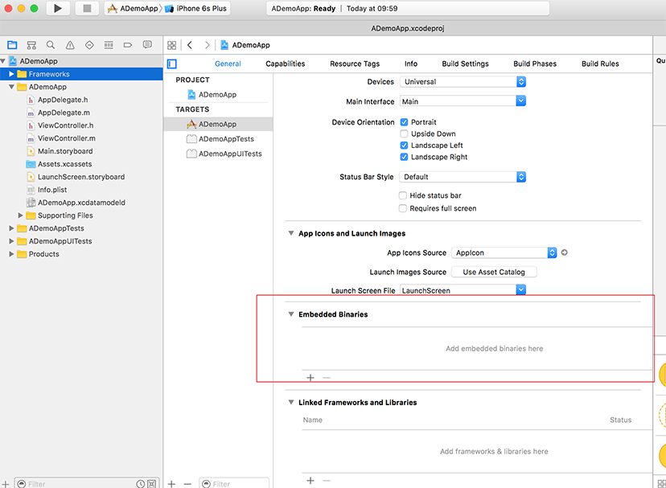
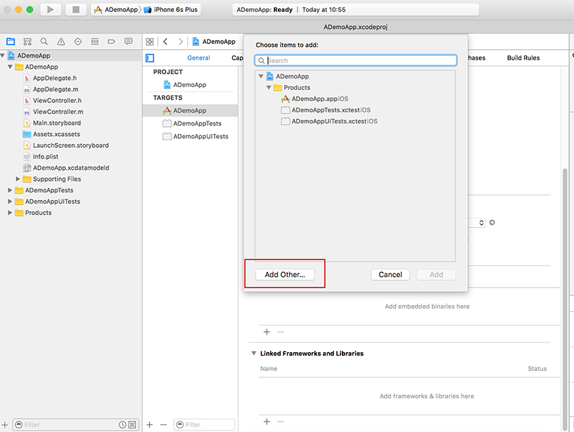
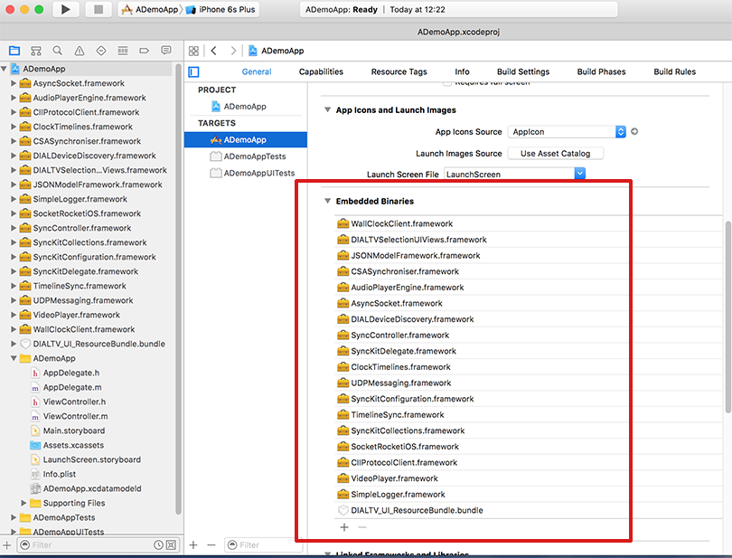

# SyncKit iOS Companion Screen DVB-CSS Synchronisation Library

**`dvbcss-synckit-ios` is a collection of iOS dynamic libraries ("Frameworks") for building media-based Companion screen applications that are synchronised frame-accurately to a TV.**

It provides iOS implementations of the client side of the [DVB CSS](https://www.dvb.org/standards/dvb_css) media-synchronisation protocols as used in [HbbTV 2](http://hbbtv.org/resource-library/#specifications) compliant connected TVs. It also includes useful building blocks such as native media players, device discovery components, loggers, WebSockets- and UDP- based messaging, JSON to Objective-C deserialisation etc.

* **[Getting Started](#getting-started)**
* **[Run the example app](#run-the-example-app)**
* **[Read the documentation](#read-the-documentation)**
* **[Overview of iOS Frameworks provided](#overview-of-ios-frameworks-provided)**
 * [Media Players](#media-players)
 * [Device Discovery](#device-discovery)
 * [Clocks and Media Timelines](#clocks-and-media-timelines)
 * [WallClock Synchronisation](#wallclock-synchronisation)
 * [Content Identification](#content-identification)
 * [Timeline Synchronisation](#yimeline-synchronisation)
 * [SyncController Objects](#synccontroller-objects)
 * [MediaSynchroniser](#mediasynchroniser)
 * [Other useful frameworks](#other-frameworks)
* **[Contact](#contact)**
* **[Licence](#licence)**


## Getting Started

When developing applications with the **SyncKit** framework, either use the lower-level components e.g. the DVB-CSS protocol clients or use the higher-level abstractions that the library provides e.g. timeline synchronisers, sync controllers and the Synchroniser singleton.

Requirements:
* XCode 7 or higher
* iOS 9.3 SDK or higher


### 1. Clone the repository

The first step is to clone this repository, or use one of the release tarballs.


### 2. Build the frameworks

To use these frameworks in your own applications, you must build and import the frameworks into your project.

#### EITHER: Use XCode to build

To build using XCode 7 or higher, simply open the workspace in Xcode, select the ```SyncKit``` scheme and build the workspace `synckit.xcworkspace`.

#### OR: Use command-line tools to build

To use the XCode command-line tool to build all the dynamic libraries: In the terminal, enter the following command whilst ensuring that you have replaced the code signing identity and keychain with your own:

    $ xcodebuild \
        -workspace synckit.xcworkspace \
        -scheme SyncKit \
        -sdk "iphoneos" \
        -configuration Release \
        CODE_SIGN_IDENTITY="iPhone Developer: John Smith(4176XXXX9)" \
        OTHER_CODE_SIGN_FLAGS="--keychain /Users/jsmith/Library/Keychains/login.keychain"

After a successful build, the dynamic libraries will be in the workspace's folder in  `DerivedData/synckit/Build/Products/Release-iphoneos/`. The ios frameworks are universal binaries; they are fit for iPhone and iPad architectures, as well as the iOS simulator.

### 3. Import frameworks into the project

In your own project, you need to import the iOS frameworks.

You will find them in their build location in the workspace's folder in `DerivedData/synckit/Build/Products/Release-iphoneos/`.

To import them, select your project's main target and go to the project's settings:



Next, in the General tab, go to the Embedded Binaries and click on the [+] button to add the frameworks. In the dialog that follows, click on the *'Add Other...'* button:



Now add these frameworks from this folder in the workspace folder: `DerivedData/synckit/Build/Products/Release-iphoneos/`:

* `AsyncSocket.framework`
* `AudioPlayerEngine.framework`
* `CIIProtocolClient.framework`
* `ClockTimelines.framework`
* `CSASynchroniser.framework`
* `DIALDeviceDiscovery.framework` (if needed)
* `DIALTVSelectionUIViews.framework` (if needed)
* `JSONModelFramework.framework`
* `SimpleLogger.framework`
* `SocketRocketiOS.framework`
* `SyncController.framework`
* `SyncKitCollections.framework`
* `SyncKitConfiguration.framework`
* `SyncKitDelegate.framework`
* `TimelineSync.framework`
* `UDPMessaging.framework`
* `VideoPlayer.framework`
* `WallClockClient.framework`

You can omit libraries you do not need. However, ensure that the dependencies of your libraries are always satisfied. Please refer to the table below for dependency information:

| iOS Framework | Depends on (requires) |
| --- | --- |
|`CIIProtocolClient.framework`|*`SimpleLogger.framework`*<br>*`SocketRocketiOS.framework`*<br>*`SyncKitCollections.framework`*<br>*`SyncKitConfiguration.framework`*|
|`CSASynchroniser.framework`|*`AudioPlayerEngine.framework`*<br>*`CIIProtocolClient.framework`*<br>*`ClockTimelines.framework`*<br>*`SimpleLogger.framework`*<br>*`SyncController.framework`*<br>*`SyncKitConfiguration.framework`*<br>*`TimelineSync.framework`*<br>*`VideoPlayer.framework`*<br>*`WallClockClient.framework`*|
|`DIALDeviceDiscovery.framework`|*`AsyncSocket.framework`*<br>*`SimpleLogger.framework`*<br>*`SyncKitCollections.framework`*<br>*`SyncKitConfiguration.framework`*|
|`DIALTVSelectionUIViews.framework`|*`DIALDeviceDiscovery.framework`*<br>*`SimpleLogger.framework`*<br>*`SyncKitCollections.framework`*<br>*`SyncKitConfiguration.framework`*<br>*`SyncKitDelegate.framework`*|
|`SyncKitCollections.framework`|*`SimpleLogger.framework`*|
|`SyncKitDelegate.framework`|*`DIALDeviceDiscovery.framework`*<br>*`SimpleLogger.framework`*<br>*`SyncKitCollections.framework`*<br>*`SyncKitConfiguration.framework`*|
|`TimelineSync.framework`|*`ClockTimelines.framework`*<br>*`JSONModelFramework.framework`*<br>*`SimpleLogger.framework`*<br>*`SocketRocketiOS.framework`*<br>*`SyncKitCollections.framework`*<br>*`SyncKitConfiguration.framework`*|
|`UDPMessaging.framework`|*`SimpleLogger.framework`*|
|`WallClockClient.framework`|*`ClockTimelines.framework`*<br>*`SimpleLogger.framework`*<br>*`SyncKitCollections.framework`*<br>*`UDPMessaging.framework`*|

**Make sure that the 'Copy Items if needed' option is selected.** Once the iOS frameworks have been added, they will be shown in your project settings and copied to your project:



Your project can now utilise these libraries.


## Run the example app

A demo iOS application ([SyncKitVideoSyncDemoApp](SyncKitVideoSyncDemoApp/)) that uses SyncKit to discover a TV on the network and synchronise a video is included.

This demo assumes that a DVB-CSS- or HbbTV 2 compliant TV/STB or emulator is being used to play a video stream. The application when deployed on an iOS device will then synchronise against that video stream.

For details on how it works and how to run it, see [the SyncKitVideoSyncDemoApp README](https://github.com/bbc/dvbcss-synckit-ios/blob/master/SyncKitVideoSyncDemoApp/README.md).

**Make sure you add the required companion media files before trying to build and run it.**

## Read the documentation

Each iOS framework in SyncKit has accompanying documentation and where applicable, example apps that demonstrate usage of the framework.

The documentation is found each framework directory in a `docs` sub-folder.


## Overview of iOS Frameworks provided
### Media Players

`AudioPlayerEngine.framework`<br/>
`VideoPlayer.framework`

These are file/stream -based media players with enhanced playback control capability. They provide the capability to adapt the way the media is being played:
* change playback position,
* change the playback speed
* query the buffered time range
* adjust the playback by an offset
* change the alignment of video and audio tracks for a video stream

The following media players are included within **dvbcss-synckit-ios**.

| Framework | Component | Description |
| --- | --- | --- |
| [AudioPlayerEngine](AudioPlayer/) |  [AudioPlayer](AudioPlayer/AudioPlayerEngine/AudioPlayerEngine/AudioPlayer.h)  | A Core Audio SDK based player for audio files (e.g. mp3, wav, aifc, aiff, m4a, mp4, caf, aac files) and audio processing via units in an audio filter graph.  |
| [AudioPlayerEngine](AudioPlayer/) |  [AudioStreamPlayer](AudioPlayerEngine/AudioPlayerEngine/AudioStreamPlayer.h)   | A Core Audio SDK based player for audio streams. It uses Apple's Audio Queue Services and AudioFileStream to handle audio buffers and audio streaming  |
| [AudioPlayerEngine](AudioPlayer/) |  [AudioPlayerViewController](AudioPlayer/AudioPlayerEngine/AudioPlayerEngine/AudioPlayerViewController.h)  | a UIViewController that uses a CoreGraphics-based audio plotting UIView to show a waveform representation of the audio data in the buffer for an AudioPlayer |
| [VideoPlayer](VideoPlayer/) |  [VideoPlayerViewController](VideoPlayer/VideoPlayer/VideoPlayer/VideoPlayerViewController.h)  | A player for video files (e.g. MP4, QuickTime) and adaptive HTTP-based streams (e.g. HLS) |

Each player uses the delegate pattern to report progress information about the media playback. Callbacks will report about:
* player's state (initialised, paused, playing, ready to play, seeking)
* current playback time (periodically called)
* end of asset reached
* media properties such as media format, duration, available tracks
* buffered media time ranges

### Device Discovery

`DIALDeviceDiscovery.framework`

The **DIALDeviceDiscovery** framework provides APIs for the discovery of services via SSDP and the discovery of devices via DIAL. It allows HbbTV terminals existing on the same network to be discovered by the Companion Screen Application.
Using the DIAL protocol, the Companion Screen Application can launch an HbbTV application on the television.

| Framework | Component | Description |
| --- | --- | --- |
| [DIALDeviceDiscovery](DIALDeviceDiscovery/) |  [SSDPServiceDiscovery](DIALDeviceDiscovery/DIALDeviceDiscovery/SSDPServiceDiscovery.h)   | Discovery of UPnP devices advertising a type of service type  |
| [DIALDeviceDiscovery](DIALDeviceDiscovery/) |  [DIALServiceDiscovery](DIALDeviceDiscovery/DIALDeviceDiscovery/SSDPServiceDiscovery.h)   | Discovery of devices on the network running a DIAL server and web applications such an HbbTV  |

### Clocks and Media Timelines

`ClockTimelines.framework`

The **ClockTimelines** framework provides software clock classes to represent timelines (of clocks and media assets). A timeline is represented by a clock object. Clock objects also allow relationships between timelines to be expressed using parent-child mapping relationships.

These clock objects work in the same way as the ones in the [pydvbcss](https://github.com/bbc/pydvbcss) python library (documented [here](http://pydvbcss.readthedocs.io/en/latest/clock.html)).

| Framework | Component | Description |
| --- | --- | --- |
| [ClockTimelines](ClockTimelines/) |  [SystemClock](ClockTimelines/ClockTimelines/SystemClock.h)   | A root clock class that is based on monotonic time as the underlying time source  |
| [ClockTimelines](ClockTimelines/) |  [CorrelatedClock](ClockTimelines/ClockTimelines/CorrelatedClock.h)   | A clock represent a timeline's relationship with a parent timeline as a correlation  |
| [ClockTimelines](ClockTimelines/) |  [TunableClock](ClockTimelines/ClockTimelines/TunableClock.h)   | A clock for a timeline with a correlation mapping to a parent clock, but with  adjustible tick offset and speed. |  


### WallClock Synchronisation

`WallClockClient.framework`

The WallClockClient framework provides an API to synchronise a WallClock with another device (e.g. an HbbTV) using the DVB-CSS WallClock Synchronisation protocol (CSS-WC). It uses UDP as the transport for CSS-WC messages. The framework allows different filters to be plugged in to exclude time offset measurements. Also, different algorithms can be plugged in to
to process the measurements and update the WallClock.

| Framework | Component | Description |
| --- | --- | --- |
| [WallClockClient](WallClockSync/) |  [WallClockSynchroniser](WallClockSync/WallClockClient/WallClockClient/WallClockSynchroniser.h)   | WallClock synchroniser using RTT Threshold filter and Lowest Dispersion algorithm |
| [WallClockClient](WallClockSync/) |  [WCProtocolClient](WallClockSync/WallClockClient/WallClockClient/WCProtocolClient.h)   | A CSS-WC protocol client  |
| [WallClockClient](WallClockSync/) |  [LowestDispersionAlgorithm](WallClockSync/WallClockClient/WallClockClient/LowestDispersionAlgorithm.h)   | Measurement-processing algo based on lowest dispersion for best-candidate selection  |
| [WallClockClient](WallClockSync/) |  [LowestDispersionFilter](WallClockSync/WallClockClient/WallClockClient/LowestDispersionFilter.h),  [RTTThresholdFilter](WallClockSync/WallClockClient/WallClockClient/RTTThresholdFilter.h) | Candidate measurement filters  |

### Content Identification

`CIIProtocolClient.framework`

The CIIProtocolClient framework allows a Companion Screen Application to receive updates about the current TV content's identifier and other service endpoints (e.g.  timeline synchronisation, material resolution (MRS), etc.). Also reported are timelines made available by the TV for synchronisation. Uses WebSockets for CSS-CII protocol.

| Framework | Component | Description |
| --- | --- | --- |
| [CIIProtocolClient](CIIProtocolClient/) |  [CIIClient](CIIProtocolClient/CIIProtocolClient/CIIClient.h)   | A CSS-CII protocol client |
| [CIIProtocolClient](CIIProtocolClient/) |  [TimelineOption](CIIProtocolClient/CIIProtocolClient/TimelineOption.h)   | A timeline description object. |

### Timeline Synchronisation

`TimelineSync.framework`

The TimelineSync framework provides an API to synchronise a timeline to the timeline exported by the TV for synchronisation (called the Synchronisation Timeline). The local estimate of the Synchronisation Timeline is represented by a CorrelatedClock object. Uses WebSockets.

| Framework | Component | Description |
| --- | --- | --- |
| [TimelineSync](TimelineSync/) |  [TSClient](TimelineSync/TimelineSync/TimelineSync/TSClient.h)   | A CSS-TS protocol client. Receives Control Timestamps from the TV. |
| [TimelineSync](TimelineSync/) |  [TimelineSynchroniser](TimelineSync/TimelineSync/TimelineSync/TimelineSynchroniser.h)   | A wrapper object that synchronises a CorrelatedClock object based on Synchronisation Timeline updates received from the TV via a TSClient|


### SyncController Objects

`SyncController.framework`

The SyncController framework provides  sync controller objects that can be used to synchronise a native media player to a given timeline. The SyncController object use a particular strategy to adapt the media player's playback (change speed of play, seek, or both) to ensure that it adheres to the given timeline.

It uses a [Correlation](ClockTimelines/ClockTimelines/CorrelatedClock.h) and a [CorrelatedClock](ClockTimelines/ClockTimelines/CorrelatedClock.h) object to synthesise the expected timeline for the media player. The Correlation gives a mapping (a pair of timestamps) between the Synchronisation Timeline and the media asset's timeline.

For web views, it provides a JS framework (ios_sync.js) to register the web page for current-time updates on the TV's timeline. The framework includes example apps to demonstrate usage of the sync controller objects.

*Currently, a SyncController class is provided for each media player/web kit.*

| Framework | Component | Description |
| --- | --- | --- |
| [SyncController](SyncController/) |  [VideoPlayerSyncController](SyncController/SyncController/SyncController/VideoPlayerSyncController.h)   | Synchronises a video player (VideoPlayerViewController) to an expected timeline |
| [SyncController](SyncController/) |  [AudioSyncController](SyncController/SyncController/SyncController/AudioSyncController.h)   | Synchronises an audio player (AudioPlayer, AudioStreamPlayer or AudioPlayerViewController) to an expected timeline |
| [SyncController](SyncController/) |  [WebViewSyncController](SyncController/SyncController/SyncController/WebViewSyncController.h)   | A SyncController to send timestamps reporting progress of a TV programme to a web view |
| [SyncController](SyncController/) |  [ios_sync.js](SyncController/SyncController/SyncController/www/ios_sync.js)   | JS library to register for register the web page for current-time updates on the TV's timeline. To be used in tandem with a [WebViewSyncController](SyncController/SyncController/SyncController/WebViewSyncController.h) on the native side. See [WebViewSyncDemoApp](SyncController/WebViewSyncDemoApp/) for usage example.|


### MediaSynchroniser

`CSASynchroniser.framework`

The CSASynchroniser (also called MediaSynchroniser) dynamic framework provides a high-level Synchroniser object for media sync. It is a singleton that Companion Screen Applications can use to synchronise a media object to an external timeline source e.g. a TV video broadcast. It simplifies launching a synchronisation process using the DVB-CSS machinery. With the Synchroniser API, media objects only need to be registered with the Synchroniser to be synchronised.

To use the Synchroniser singletob, you need to initialise it with these parameters

* ```InterDeviceSyncURL``` - the master device's URL for interdevice synchronisation (obtained from discovery of the TV using DIAL, see [DIALDeviceDiscovery](../DIALDeviceDiscovery) sub-project for examples).
* ```App2AppURL``` - the master device's endpoint for communication between TV apps and companion screen Applications.
* ```TimelineSelector``` - a ```TimelineOption``` object providing a timeline name and other properties (e.g. tick rate, accuracy).

Media players are registered with the Synchroniser by adding MediaPlayerObject objects.

| Framework | Component | Description |
| --- | --- | --- |
| [CSASynchroniser](MediaSynchroniser/) |  [MediaPlayerObject](/MediaSynchroniser/CSASynchroniser/CSASynchroniser/MediaPlayerObject.h)   | An object encapsulating a media player instance, the media URL and a correlation for mapping the Synchronisation Timeline to the media timeline |
| [CSASynchroniser](MediaSynchroniser/) |  [Synchroniser](MediaSynchroniser/CSASynchroniser/CSASynchroniser/Synchroniser.h)   | A singleton that accepts  MediaPlayerObject instances (each playing a media object) or web views to synchronise against a  TV |

### Other Frameworks

**dvbcss-synckit-ios** also includes a number of useful fine-grain dynamic libraries.

##### UI Components
| Framework | Component | Description |
| --- | --- | --- |
| [DIALTVSelectionUIViews](DIALDeviceDiscovery/DIALTVSelectionUIViews/) |  [DIALDeviceCollectionViewController](DIALDeviceDiscovery/DIALTVSelectionUIViews/DIALTVSelectionUIViews/DIALDeviceCollectionViewController.h)   | A ViewController which displays devices discovered by the DIALDeviceDiscovery framework as a collection (UICollectionView)|
| [DIALTVSelectionUIViews](DIALDeviceDiscovery/DIALTVSelectionUIViews/) |  [DIALDeviceSelectorViewController](DIALDeviceDiscovery/DIALTVSelectionUIViews/DIALTVSelectionUIViews/DIALDeviceSelectorViewController.h)   |A ViewController which displays devices discovered by the DIALDeviceDiscovery framework as a list (UITableView)  |

##### Communications

| Framework | Component | Description |
| --- | --- | --- |
| [AsyncSocket](AsyncSocket/AsyncSocket/) |  [GCDAsyncUdpSocket](AsyncSocket/AsyncSocket/AsyncSocket/GCDAsyncUdpSocket.h)   |  A UDP/IP socket networking framework built atop Grand Central Dispatch. |
| [UDPMessaging](UDPMessaging/UDPMessaging/) |  [UDPEndpoint](UDPMessaging/UDPMessaging/UDPEndpoint.h)   | A class representing a UDP socket endpoint (server- or client-mode)  |
| [SocketRocket](WebSocket/SocketRocket/) |  [SRWebSocket](WebSocket/SocketRocket/SocketRocket/SRWebSocket.h)   |  Facebook's [SRWebSocket](https://github.com/facebook/SocketRocket) framework (available under a BSD-licence) re-packaged as an iOS framework |
| [JSONModelFramework](JSONModelFramework/) |  [SRWebSocket](JSONModelFramework/JSONModelFramework/)   |  Framework for serialising Objective C objects into JSON and deserialise JSON back to Objective C. A repackaging of the open-source [JSONModel](https://github.com/jsonmodel/jsonmodel) library as an iOS framework |

##### Logging, Configuration and other utilities

| Framework | Component | Description |
| --- | --- | --- |
| [SimpleLogger](SimpleLogger/) |  [SimpleLogger](SimpleLogger/SimpleLogger/MWLogging.h)   |  Simple wrapper macros/functions around ASL (Apple System Log) |
| [SyncKitConfiguration](SyncKitConfiguration/) |  [ConfigReader](SyncKitConfiguration/SyncKitConfiguration/ConfigReader.h)   | A library to read configuration key-value pairs from a config file and make them globally available.  |
| [SyncKitCollections](SyncKitCollections/) |  [SyncKitCollections](SyncKitCollections/SyncKitCollections/) |  A collection of data structures and utility classes.|


## Contact

The original author is Rajiv Ramdhany 'at' bbc.co.uk.


## Licence

The **dvbcss-synckit-ios**  iOS library is developed by BBC R&D and distributed under the Apache License, [Version 2.0](http://www.apache.org/licenses/LICENSE-2.0).

© Copyright 2016 BBC R&D. All Rights Reserved
