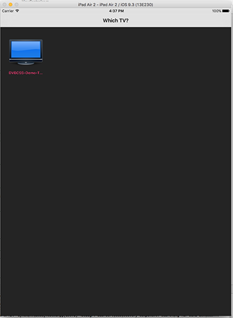

# A Video Stream Synchronisation Demo App using SyncKit's Synchroniser object

This demo app demonstrates the synchronisation of companion videos to a broadcast stream that embeds a TEMI timeline.

It provides an example of how to the use of the SyncKit library's Synchroniser object. It shows how in response to a change of contentId signalled by the TV, the companion screen app can load a relevant media object and register it with a Synchroniser object for synchronisation.

## Running the demo app
To run the demo app, follow these steps

### Step 1: Open the demo app

This demo app is part of the [dvbcss-synckit-ios](../) distribution. After you have cloned the repository, open the workspace `synckit.xcworkspace` in XCode.

The code for the demo app is in the `SyncKitVideoSyncDemoApp` project.

### Step 2:  Get the TV and companion Content

The example app assumes that the TV is playing the **"mux.ts.24mbit.with_temi.ts"** broadcast transport stream. This transport stream has both PTS and TEMI timelines signalled in it. The demo companion app uses the TEMI timeline for synchronisation (switching to PTS timeline is trivial).

The broadcast transport stream and companion content for each of the channels it contains are available from this site: https://hbbtv-2-0-testing-1.virt.ch.bbc.co.uk/downloads/simple-free-sync-seq-1.zip

Download this zipped file and extract it into a known location on your build device.

Rename the following files as suggested:

1. `channel_a.companion/video.mp4` file to `channel_a.companion/video_a.mp4`
1. `channel_b.companion/video.mp4` file to `channel_b.companion/video_b.mp4`
1. `channel_c.companion/video.mp4` file to `channel_c.companion/video_c.mp4`

### Step 3: Add the companion content to the demo app

In the `SyncKitVideoSyncDemoApp` project, right-click on the `Supporting Files` folder and select the `Add files to SyncKitVideoSyncDemoApp ..` option.

In the dialog that follows, select these files from the location where you originally downloaded them and add them to `SyncKitVideoSyncDemoApp` project:

1. `channel_a.companion/video_a.mp4`
1. `channel_b.companion/video_b.mp4`
1. `channel_c.companion/video_c.mp4`

### Step 4: Build and run the demo app

In XCode, select the `SyncKitVideoSyncDemoApp` build scheme and launch the build process to deploy the app into a selected target iOS device (or iOS simulator).   

** Make sure that the TV and the companion device are on the same network**

The first screen shows TV devices discovered via DIAL on the local network.





## Using Alternative Timelines for Sync in the demo app

Assuming you have an HbbTV2.0 compliant TV/device on the network, or a DVB-CSS TV emulator, it is possible to discover its current content identifier and the timelines the device exposes for synchronisation.

### Step 1: Discover available timelines

To discover available timelines, you may use a CII client to connect to your TV's CSS-CII protocol server endpoint. A CII client can be obtained from the [pydvbcss](https://github.com/bbc/pydvbcss) distribution.

You can run the `pydvbcss` CII protocol python client as follows:

```bash
$ python examples/CIIClient.py ws:/<TV_IP_ADDRESS>:7681/cii

```

A sample output of the tool looks like this:

```bash

RD000400:pydvbcss rajivr$ python examples/CIIClient.py ws://10.5.11.163:7681/cii
INFO:CIIClient:connected
INFO:CIIClient:change to presentationStatus property. Value is now: [u'okay']
INFO:CIIClient:change to protocolVersion property. Value is now: 1.1
INFO:CIIClient:change to mrsUrl property. Value is now: None
INFO:CIIClient:change to timelines property. Value is now: [TimelineOption(timelineSelector="tag:rd.bbc.co.uk,2015-12-08:dvb:css:timeline:simple-elapsed-time:5000", unitsPertick=1, unitsPerSecond=5000, accuracy=OMIT private=OMIT), TimelineOption(timelineSelector="tag:rd.bbc.co.uk,2015-12-08:dvb:css:timeline:simple-elapsed-time:1000", unitsPertick=1, unitsPerSecond=1000, accuracy=OMIT private=OMIT)]
INFO:CIIClient:change to tsUrl property. Value is now: ws://10.5.11.163:7681/ts
INFO:CIIClient:change to wcUrl property. Value is now: udp://10.5.11.163:6677
INFO:CIIClient:change to contentIdStatus property. Value is now: final
INFO:CIIClient:change to contentId property. Value is now: http://127.0.0.1:8123/channel_B_video.mp4
INFO:CIIClient:CII is now: CII(presentationStatus=[u'okay'], protocolVersion=u'1.1', mrsUrl=None, timelines=[TimelineOption(timelineSelector="tag:rd.bbc.co.uk,2015-12-08:dvb:css:timeline:simple-elapsed-time:5000", unitsPertick=1, unitsPerSecond=5000, accuracy=OMIT private=OMIT), TimelineOption(timelineSelector="tag:rd.bbc.co.uk,2015-12-08:dvb:css:timeline:simple-elapsed-time:1000", unitsPertick=1, unitsPerSecond=1000, accuracy=OMIT private=OMIT)], tsUrl=u'ws://10.5.11.163:7681/ts', wcUrl=u'udp://10.5.11.163:6677', contentIdStatus=u'final', contentId=u'http://127.0.0.1:8123/channel_B_video.mp4')

```
* The contentId in this example is **"http://127.0.0.1:8123/channel_B_video.mp4"**
* Available timelines are given by the **timelines** field.

### Step 2:
You can use one of the listed timelines for synchronisation.

For example, to make the demo app use the PTS TV timeline for synchronisation, you will need to do the following:

1. Initialise the Synchroniser object to use the PTS timeline.
In the `viewDidLoad()` method in the ViewController class (`ViewController.m` file), specify the PTS timeline in the initialisation routine:

```objective-c
[self.mediaSynchroniser initWithInterDeviceSyncURL:device.HbbTV_InterDevSyncURL
                                                                         App2AppURL:device.HbbTV_App2AppURL
                                                                       MediaObjects:nil
                                                                   TimelineSelector:pts_timeline
                                                                           Delegate:self];
```

`pts_timeline` is an object that describes a PTS timeline.

2. For each media object representing a specific companion content, change  its correlation to refer to the PTS timeline.

The correlation is a pair of timestamps representing a time on the TV timeline and the corresponding time on the companion content's timeline.

For example, for companion video A, the media object's correlation is modified as follows:

```objective-c

- (void) Synchroniser: (Synchroniser*) synchroniser NewContentInfoAvailable:(CII*) cii ChangeMask:(CIIChangeStatus) cii_change_mask
{
  // ...
  Correlation PTS_Timeline_corel = [CorrelationFactory create:A_PTS_Timeline_Start_Pos Correlation: Video_A_Timeline_Start_Pos];

  mediaObj.correlation = PTS_Timeline_corel;
  mediaObj.mediaTitle = @"companion video A";
  mediaObj.mediaMIMEType = @"video/mp4";
  mediaObj.priority = [NSNumber numberWithInt:1];
  // ...
}

```


The values for the correlation's parent timeline timestamp are already defined as constants in `ViewController.m`.

```objective-c
int const A_PTS_Timeline_Start_Pos = 900000;
int const A_TEMI_Timeline_Start_Pos = 0;
int const A_SET_Timeline_Start_Pos = 0;
```


## Contact

The original author is Rajiv Ramdhany 'at' bbc.co.uk.


## Licence

The CSASynchroniser iOS Framework is developed by BBC R&D and distributed under the Apache License, [Version 2.0](http://www.apache.org/licenses/LICENSE-2.0).

© Copyright 2016 BBC R&D. All Rights Reserved
